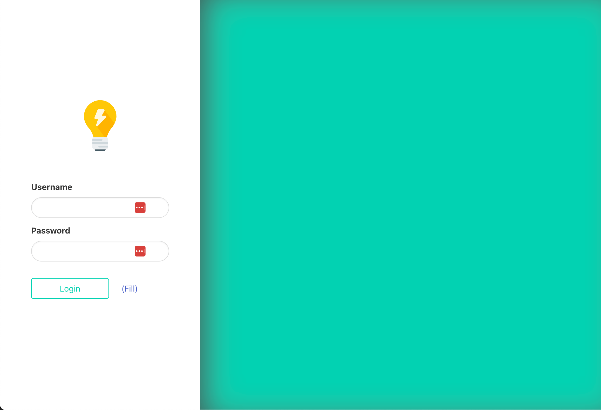
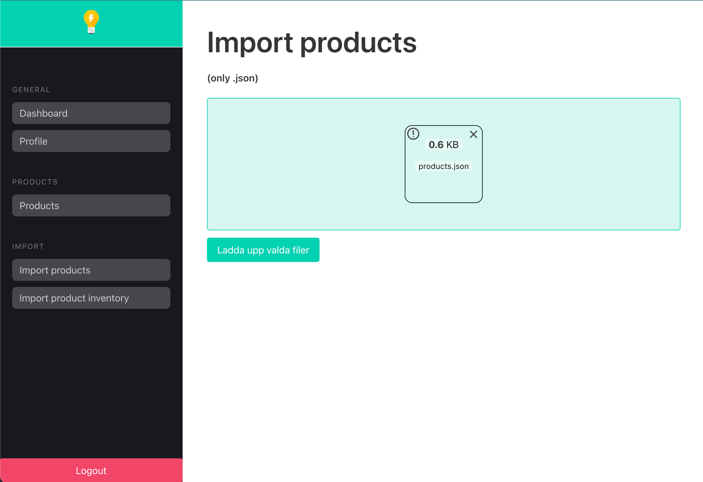
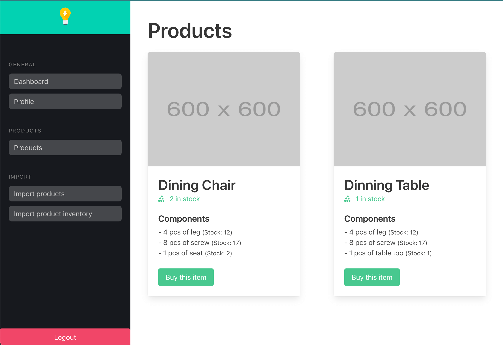
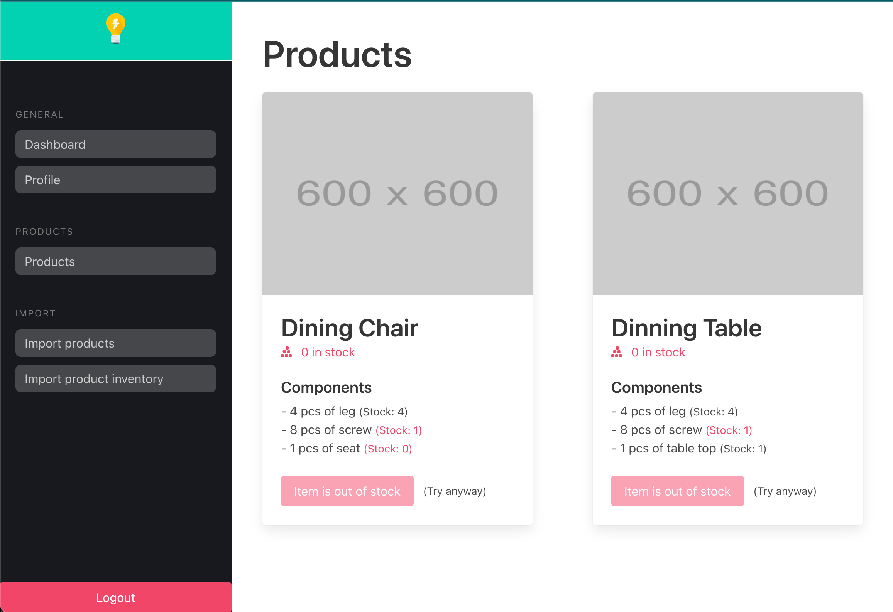

# Code Assignment

Built as a backoffice communicating with an API.

- API: Laravel 9
- Backoffice: Vite.js with Vue 3 using composition api (SPA)

The project contains:
-

- Authentication with bearer token. Login, logout, view profile data
- Importing products and inventory with drag-n-drop function. Request is sent to the API where the .json files are imported into the database.
- View products and its availability. Also listing each belonging component/part to the product with its stock.

